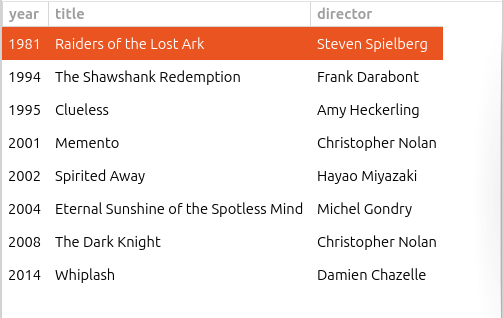

# AGtk

AGtk is a library of helper classes for GTK 4 in C#.

Well, actually at the moment there's only one helper class: AGtk.ColView, plus some convenient extension methods for working with actions.  But perhaps I'll add more classes in the future.

## AGtk.ColView

AGtk.ColView is a subclass of the Gtk.ColumnView class, which displays a multi-column list.  Gtk.ColumnView has a complicated API, so AGtk.ColView exists to make it much easier to use.  Here's a brief code sample to show how easy it is:

```C#
AGtk.ColView col_view = new(["year", "title", "director"]);

col_view.Add([1981, "Raiders of the Lost Ark", "Steven Spielberg"]);
col_view.Add([1994, "The Shawshank Redemption", "Frank Darabont"]);
col_view.Add([1995, "Clueless", "Amy Heckerling"]);
...

my_window.Child = col_view;
```

That will produce a column view that looks like this:




You can sort on any column by clicking on the column's header.  AGtk.ColView compares objects by casting them to [IComparable](https://learn.microsoft.com/en-us/dotnet/api/system.icomparable?view=net-8.0).  For this reason, currently all objects added to a visible column must implement the IComparable interface.  This is not too restrictive, since many useful types such as int and string do implement IComparable.

If a column name is null, the column is invisible and you can add any object you like to it.  This can be useful for storing data that you want to retrieve along with the selected column.

### Adding filtering

AGtk.ColView supports dynamic filtering.  Typically you'll use this with a search box: as the user types in the box, rows will be filtered.  Here's how to do this in code:

```C#
// specify the column to use for filtering
col_view.FilterColumn = 1;   // title

SearchEntry entry = new();
entry.OnSearchChanged += on_search_changed;

...

void on_search_changed(SearchEntry sender, EventArgs args) {
    col_view.FilterText = entry.GetText();
}
```

### A larger example

My page [Introduction to GTK 4 in C#](https://ksvi.mff.cuni.cz/~dingle/2024-5/prog_2/gtk4_introduction.html) contains a [complete example]( https://ksvi.mff.cuni.cz/~dingle/2024-5/prog_2/gtk4_introduction.html#Column%20views|outline) of a program using AGtk.ColView.

## Extension methods for actions

AGtk includes a couple of convenient extension methods for adding actions to a GtkWindow or GtkApplication.  For example, in a GtkWindow subclass you can call

```
this.AddAction("open", on_open);
```

This call will add an action "open" that will call on_open() when activated.

```
this.AddToggleAction("show_statusbar", true, on_show_statusbar);
```

This call will add a toggle action called "show_statusbar".  The corresponding menu item will display a checkbox, which will be initially checked since the second argument is 'true'.  on_show_statusbar() will be called when the user toggles the checkbox, and will receive a boolean indicating the current toggle state.

To make these extension methods available, you must use the AGtk namespace:

```
using AGtk;
```

My page [Introduction to GTK 4 in C#](https://ksvi.mff.cuni.cz/~dingle/2024-5/prog_2/gtk4_introduction.html) contains a [complete example](https://ksvi.mff.cuni.cz/~dingle/2024-5/prog_2/gtk4_introduction.html#Menus|outline) of a program using these extension methods.

## Using the library

AGtk is available as a nuget package:

```
$ dotnet add package AGtk
```

The current version number is 0.4.1.

## API reference
All members listed below are public.

### ColView

<dl>
<dt><code>ColView(params string?[] names)</code></dt>
<dd>Create a ColView with the given column names.  A column name that is null represents an invisible column.</dd>
<dt><code>void Add(params object[] values)</code></dt>
<dd>Append a row of values to the view.  Any value added to a visible column must be comparable, i.e. be an instance of IComparable.  </dd>
<dt><code>void Clear()</code></dt>
<dd>Remove all rows from the view.</dd>
<dt><code>void DeleteRow(uint index)</code></dt>
<dd>Delete a row by index.</dd>
<dt><code>int? FilterColumn {get; set; }</code></dt>
<dd>The 0-based index of the column used for filtering.</dd>
<dt><code>string FilterText {get; set; }</code></dt>
<dd>The text to use for filtering.  Only rows whose filter column contains this text will be shown.  If the value is "", all rows will be displayed.</dd>
<dt><code>event RightClick? OnRightClick</code></dt>
<dd>An event that fires when the user right clicks the mouse on a row.</dd>
<dt><code>uint RowCount { get; }</code></dt>
<dd>The number of rows in this ColView.</dd>
<dt><code>RowList Rows {get;}</code></dt>
<dd>A list of rows in this ColView.</dd>
<dt><code>uint SelectedIndex {get; set;}</code></dt>
<dd>The index of the row that is currently selected.</dd>
<dt><code>event SelectionChanged? OnSelectionChanged</code></dt>
<dd>An event that fires whenever the selection changes.</dd>
</dl>

### RightClick

A delegate type for a right mouse click event.

<dl>
<dt><code>delegate void RightClick(int x, int y, uint rowIndex)</code></dt>
<dd>(x, y) is the position where the user clicked.  rowIndex is the index of the row below the mouse click.</dd>
</dl>

### Row

A row in the column view.

<dl>
<dt><code>public ValueList Values { get; }</code></dt>
<dd>An list of values in the row.</dd>
</dl>

### RowList

A list of rows.

<dl>
<dt><code>Row this[uint i] { get; }</code></dt>
<dd>An indexer to retrieve a Row.</dd>
</dl>

### SelectedChanged

A delegate type for a selection change event.

<dl>
<dt><code>delegate void SelectionChanged(uint rowIndex)</code></dt>
<dd>rowIndex is the index of the currently selected row.</dd>
</dl>

### ValueList

A list of values in a row.

<dl>
<dt><code>object this[int col] { get; set; }</code></dt>
<dd>An indexer to get or set a value.</dd>
</dl>

### Helpers

Extension methods for actions.

<dl>
<dt><code>static SimpleAction AddAction(this Gio.ActionMap map, string name, Action f)</code></dt>
<dd>Add a named action with a function to be called on activation.</dd>
<dt><code>static SimpleAction AddToggleAction(this Gio.ActionMap map, string name, bool initial, Action&lt;bool&gt;? f)</code>
<dd>Add a named toggle action.  The corresponding menu item will display a checkbox, which will be initially checked if <code>initial</code> is true.  If <code>f</code> is non-null, it will be called when the user toggles the checkbox, and will receive a boolean value indicating the current toggle state.</dd>
<dt><code>static bool GetToggled(this SimpleAction action)</code></dt>
<dd>Retrieve the boolean state of a toggle action.</dd>
<dt><code>static void SetToggled(this SimpleAction action, bool b)</code></dt>
<dd>Set the boolean state of a toggle action.</dd>
</dl>
